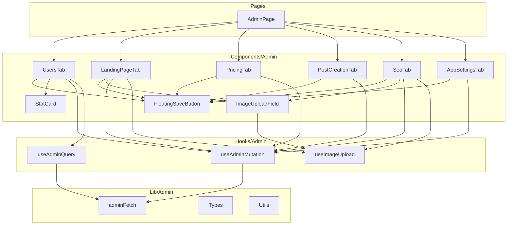

# Admin.tsx Refactoring Plan

## Current State Analysis

The [`admin.tsx`](../client/src/pages/admin.tsx) file is **1,799 lines** long and contains multiple distinct features that should be separated for better maintainability.

### Current Structure

```
admin.tsx (1,799 lines)
├── Types/Interfaces (lines 18-47)
│   ├── AdminStats
│   └── AdminUser
├── Utilities (lines 49-98)
│   ├── adminFetch()
│   ├── AdminFloatingSaveButton
│   └── slugifyCatalogId()
├── Tab Components
│   ├── UsersTab (lines 100-429) ~330 lines
│   ├── LandingPageTab (lines 431-878) ~447 lines
│   ├── AdminPricingTab (lines 880-1016) ~136 lines
│   ├── PostCreationTab (lines 1018-1395) ~377 lines
│   ├── SeoTab (lines 1413-1643) ~230 lines
│   └── AppSettingsTab (lines 1645-1799) ~154 lines
└── AdminPage main component (lines 1397-1411)
```

### Issues Identified

| Issue | Description | Impact |
|-------|-------------|--------|
| **Monolithic File** | 1,799 lines in single file | Hard to navigate, slow to load |
| **Duplicated Patterns** | Similar mutations, uploads, loading states | Code bloat, inconsistent UX |
| **No Custom Hooks** | Logic embedded in components | Not reusable, hard to test |
| **Mixed Concerns** | Data fetching + state + UI in each tab | Hard to maintain |
| **Duplicated Upload Logic** | Logo, icon, OG image uploads are nearly identical | DRY violation |

---

## Proposed Architecture

### Directory Structure

```
client/src/
├── pages/
│   └── admin.tsx (refactored - ~100 lines)
├── components/
│   └── admin/
│       ├── index.ts                    # Barrel export
│       ├── users-tab.tsx               # User management
│       ├── landing-page-tab.tsx        # Landing page content editor
│       ├── pricing-tab.tsx             # Pricing settings
│       ├── post-creation-tab.tsx       # Style catalog management
│       ├── seo-tab.tsx                 # SEO settings
│       ├── app-settings-tab.tsx        # App branding settings
│       ├── admin-floating-save-button.tsx
│       ├── image-upload-field.tsx      # Reusable image uploader
│       └── stat-card.tsx               # Dashboard stat card
├── hooks/
│   └── admin/
│       ├── index.ts                    # Barrel export
│       ├── use-admin-mutation.ts       # Generic admin mutation hook
│       ├── use-admin-query.ts          # Generic admin query hook
│       └── use-image-upload.ts         # Image upload logic
└── lib/
    └── admin/
        ├── index.ts                    # Barrel export
        ├── admin-fetch.ts              # Authenticated fetch helper
        ├── types.ts                    # Admin-specific types
        └── utils.ts                    # slugifyCatalogId, formatCost, etc.
```

### Component Diagram



---

## Implementation Steps

### Phase 1: Foundation - Types and Utilities

#### Step 1.1: Create Admin Types
**File:** `client/src/lib/admin/types.ts`

Extract from current file:
- `AdminStats` interface
- `AdminUser` interface
- `StatusFilter` type
- `SortField` type
- `SortDir` type

#### Step 1.2: Create Admin Utilities
**File:** `client/src/lib/admin/utils.ts`

Extract:
- `adminFetch()` function
- `slugifyCatalogId()` function
- `formatCost()` function (from UsersTab)
- `matchStatus()` function (from UsersTab)

#### Step 1.3: Create Barrel Export
**File:** `client/src/lib/admin/index.ts`

---

### Phase 2: Custom Hooks

#### Step 2.1: Create useAdminQuery Hook
**File:** `client/src/hooks/admin/use-admin-query.ts`

Generic hook for admin data fetching with:
- Automatic auth token injection
- Loading/error states
- TypeScript generics

```typescript
// Example signature
function useAdminQuery<T>(path: string, options?: {
  queryKey?: string[];
  enabled?: boolean;
})
```

#### Step 2.2: Create useAdminMutation Hook
**File:** `client/src/hooks/admin/use-admin-mutation.ts`

Generic hook for admin mutations with:
- Automatic auth token injection
- Success/error toast handling
- Query invalidation

```typescript
// Example signature
function useAdminMutation<TData, TPayload>(path: string, options?: {
  method?: 'POST' | 'PATCH' | 'DELETE';
  onSuccess?: (data: TData) => void;
  invalidateKeys?: string[][];
})
```

#### Step 2.3: Create useImageUpload Hook
**File:** `client/src/hooks/admin/use-image-upload.ts`

Extract common upload logic:
- File validation
- Base64 conversion
- Upload state management
- Error handling

---

### Phase 3: Shared Components

#### Step 3.1: Extract AdminFloatingSaveButton
**File:** `client/src/components/admin/admin-floating-save-button.tsx`

Already a separate component - just move to new location.

#### Step 3.2: Create ImageUploadField Component
**File:** `client/src/components/admin/image-upload-field.tsx`

Reusable component for image uploads with:
- Drag and drop support
- Preview display
- Upload progress
- File type validation

Props:
```typescript
interface ImageUploadFieldProps {
  value?: string;
  onChange: (url: string) => void;
  uploadEndpoint: string;
  acceptedTypes: string[];
  label: string;
  description?: string;
  previewHeight?: string;
}
```

#### Step 3.3: Create StatCard Component
**File:** `client/src/components/admin/stat-card.tsx`

Extract from UsersTab for reusability:
- Icon support
- Clickable filter
- Loading state

---

### Phase 4: Extract Tab Components

#### Step 4.1: Extract UsersTab
**File:** `client/src/components/admin/users-tab.tsx`

Contents:
- User stats cards
- User search/filter
- User table
- Admin/Affiliate toggle buttons

#### Step 4.2: Extract LandingPageTab
**File:** `client/src/components/admin/landing-page-tab.tsx`

Contents:
- Hero section form
- Branding section with logo/icon uploads
- Features section form
- How It Works section form
- Testimonials section form
- CTA section form

#### Step 4.3: Extract AdminPricingTab
**File:** `client/src/components/admin/pricing-tab.tsx`

Contents:
- Pay-per-use pricing form
- Recharge defaults form

#### Step 4.4: Extract PostCreationTab
**File:** `client/src/components/admin/post-creation-tab.tsx`

Contents:
- Brand styles management
- Post moods management
- Add/remove/edit functionality

#### Step 4.5: Extract SeoTab
**File:** `client/src/components/admin/seo-tab.tsx`

Contents:
- Meta tags form
- OG image upload
- Legal links form

#### Step 4.6: Extract AppSettingsTab
**File:** `client/src/components/admin/app-settings-tab.tsx`

Contents:
- App branding form
- Color pickers

---

### Phase 5: Refactor Main Admin Page

#### Step 5.1: Update AdminPage
**File:** `client/src/pages/admin.tsx`

Reduce to ~100 lines:
- Import tab components
- Tab routing logic
- Layout wrapper

---

## File Size Estimates

| File | Estimated Lines |
|------|-----------------|
| `admin.tsx` (refactored) | ~80-100 |
| `users-tab.tsx` | ~280-320 |
| `landing-page-tab.tsx` | ~350-400 |
| `pricing-tab.tsx` | ~100-120 |
| `post-creation-tab.tsx` | ~320-360 |
| `seo-tab.tsx` | ~180-200 |
| `app-settings-tab.tsx` | ~120-140 |
| `admin-floating-save-button.tsx` | ~30-40 |
| `image-upload-field.tsx` | ~100-120 |
| `stat-card.tsx` | ~50-60 |
| `use-admin-query.ts` | ~30-40 |
| `use-admin-mutation.ts` | ~50-60 |
| `use-image-upload.ts` | ~60-80 |
| `types.ts` | ~40-50 |
| `utils.ts` | ~50-60 |

---

## Benefits of Refactoring

1. **Maintainability**: Each file has a single responsibility
2. **Testability**: Hooks and utilities can be tested independently
3. **Reusability**: Image upload and stat cards can be reused
4. **Performance**: Smaller files load faster in IDE
5. **Collaboration**: Multiple developers can work on different tabs
6. **Consistency**: Shared hooks ensure consistent error handling

---

## Migration Strategy

### Option A: Big Bang
- Create all new files in one PR
- Update imports in admin.tsx
- Delete old code

### Option B: Incremental (Recommended)
1. Create foundation (types, utils)
2. Extract one tab at a time
3. Test each extraction
4. Complete with main page refactor

---

## Testing Checklist

After refactoring, verify:
- [ ] All tabs render correctly
- [ ] User search/filter works
- [ ] Admin toggle works
- [ ] Affiliate toggle works
- [ ] Landing page content saves
- [ ] Logo/icon upload works
- [ ] Pricing settings save
- [ ] Style catalog CRUD works
- [ ] Post mood CRUD works
- [ ] SEO settings save
- [ ] OG image upload works
- [ ] App settings save
- [ ] Color pickers work
- [ ] All floating save buttons work
- [ ] Loading states display correctly
- [ ] Error toasts appear on failures
- [ ] Success toasts appear on save
