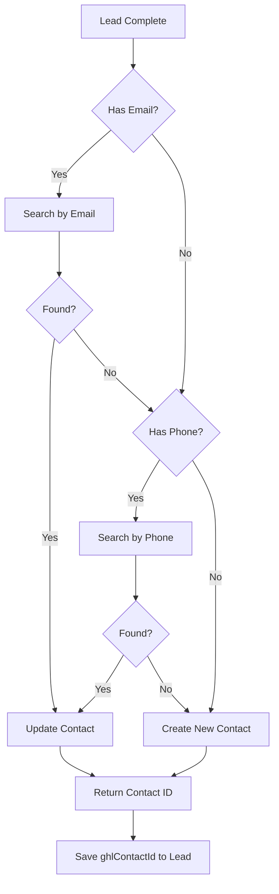
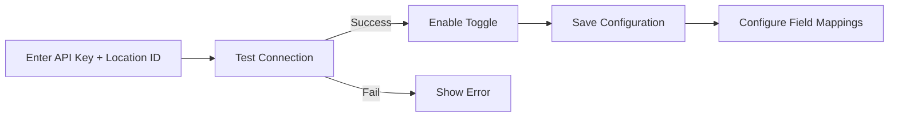

# GoHighLevel (GHL) Integration Plan

## Overview

This plan outlines the implementation of a GoHighLevel integration for lead/contact synchronization. The integration will allow admins to configure GHL credentials and enable automatic syncing of leads/contacts to GHL when forms are completed or chat interactions conclude.

## Architecture Diagram

```mermaid
flowchart TB
    subgraph Admin UI
        IT[IntegrationsTab.tsx]
        IT --> |GET /api/admin/ghl| GHL_STATUS[Get GHL Config]
        IT --> |PATCH /api/admin/ghl| GHL_SAVE[Save GHL Config]
        IT --> |POST /api/admin/ghl/test| GHL_TEST[Test Connection]
        IT --> |GET /api/admin/ghl/custom-fields| GHL_FIELDS[Get Custom Fields]
    end

    subgraph Server Routes
        GHL_STATUS --> GHL_ROUTES[integrations.routes.ts]
        GHL_SAVE --> GHL_ROUTES
        GHL_TEST --> GHL_ROUTES
        GHL_FIELDS --> GHL_ROUTES
    end

    subgraph GHL Service
        GHL_ROUTES --> GHL_TS[server/integrations/ghl.ts]
        GHL_TS --> |API calls| GHL_API[GoHighLevel API]
    end

    subgraph Lead Sync Triggers
        FORM[/api/form-leads/progress] --> |lead complete| SYNC_LOGIC[Sync to GHL]
        CHAT[AI tool: complete_lead] --> |lead complete| SYNC_LOGIC
        SYNC_LOGIC --> GHL_TS
    end

    subgraph Database
        IS[integration_settings table]
        FL[form_leads table]
        GHL_TS --> |read/write| IS
        SYNC_LOGIC --> |update| FL
    end
```

## Components

### 1. Database Schema

#### integration_settings Table
Stores GHL API credentials and configuration.

```sql
CREATE TABLE integration_settings (
    id UUID PRIMARY KEY DEFAULT gen_random_uuid(),
    integration_type TEXT NOT NULL UNIQUE, -- 'ghl'
    api_key TEXT, -- Encrypted or masked
    location_id TEXT, -- GHL location ID
    enabled BOOLEAN DEFAULT false,
    custom_field_mappings JSONB DEFAULT '{}',
    last_sync_at TIMESTAMPTZ,
    created_at TIMESTAMPTZ DEFAULT NOW(),
    updated_at TIMESTAMPTZ DEFAULT NOW()
);
```

#### form_leads Table Additions
Add GHL sync tracking fields.

```sql
ALTER TABLE form_leads ADD COLUMN ghl_contact_id TEXT;
ALTER TABLE form_leads ADD COLUMN ghl_sync_status TEXT DEFAULT 'pending';
-- Status values: pending, synced, failed
```

### 2. GHL API Wrapper - server/integrations/ghl.ts

Core methods to implement:

| Method | Purpose | GHL API Endpoint |
|---------|---------|------------------|
| testGHLConnection | Validate API credentials | GET /contacts/ |
| getGHLCustomFields | Fetch available custom fields | GET /customFields/ |
| getOrCreateGHLContact | Find or create contact | GET + POST /contacts/ |
| updateGHLContact | Update existing contact | PUT /contacts/{id} |
| searchContactByEmail | Find contact by email | GET /contacts/search |
| searchContactByPhone | Find contact by phone | GET /contacts/search |

#### Contact Sync Strategy



### 3. Admin API Routes

Add to server/routes/integrations.routes.ts:

| Endpoint | Method | Purpose |
|----------|--------|---------|
| /api/admin/ghl | GET | Get current GHL config with masked API key |
| /api/admin/ghl | PATCH | Save GHL config with validation |
| /api/admin/ghl/test | POST | Test GHL connection |
| /api/admin/ghl/custom-fields | GET | Fetch available custom fields from GHL |

#### API Key Security
- Never return full API key in GET responses - mask as `********`
- Validate API key format before saving
- Require successful test before enabling integration

### 4. Frontend UI - IntegrationsTab.tsx

Add GHL configuration card with:

1. **Toggle Switch** - Enable/disable GHL integration
2. **API Key Input** - Password field with masking
3. **Location ID Input** - GHL location ID
4. **Test Connection Button** - Validates credentials
5. **Status Indicator** - Shows connection state
6. **Custom Field Mapping** - Map form fields to GHL custom fields

UI Flow:


### 5. Lead Sync Integration Points

#### Form Flow - server/app-routes.ts
In the `/api/form-leads/progress` endpoint when lead is marked complete:
1. Check if GHL integration is enabled
2. Build contact payload from form answers
3. Call getOrCreateGHLContact
4. Update form_leads with ghlContactId and ghlSyncStatus

#### Chat Flow - AI Tool
In the `complete_lead` AI tool handler:
1. Same logic as form flow
2. Extract contact info from chat context

### 6. Shared Schema Updates - shared/schema.ts

Add Zod schemas for:

```typescript
// GHL Integration Settings
export const ghlIntegrationSettingsSchema = z.object({
  enabled: z.boolean(),
  api_key: z.string().nullable(), // Masked on read
  location_id: z.string().nullable(),
  custom_field_mappings: z.record(z.string()).optional(),
  last_sync_at: z.string().nullable(),
});

// GHL Custom Field
export const ghlCustomFieldSchema = z.object({
  id: z.string(),
  name: z.string(),
  key: z.string(),
  type: z.string().optional(),
});

// GHL Contact Payload
export const ghlContactPayloadSchema = z.object({
  email: z.string().email().optional(),
  phone: z.string().optional(),
  firstName: z.string().optional(),
  lastName: z.string().optional(),
  name: z.string().optional(),
  address1: z.string().optional(),
  city: z.string().optional(),
  state: z.string().optional(),
  postalCode: z.string().optional(),
  country: z.string().optional(),
  customFields: z.record(z.string()).optional(),
  source: z.string().optional(),
  tags: z.array(z.string()).optional(),
});

// Admin GHL Status Response
export const adminGHLStatusSchema = z.object({
  configured: z.boolean(),
  enabled: z.boolean(),
  api_key_masked: z.string().nullable(),
  location_id: z.string().nullable(),
  last_sync_at: z.string().nullable(),
  connection_status: z.enum(['connected', 'disconnected', 'error']),
});
```

## File Changes Summary

| File | Action | Description |
|------|--------|-------------|
| server/integrations/ghl.ts | Create | GHL API wrapper with all methods |
| server/routes/integrations.routes.ts | Modify | Add GHL admin endpoints |
| shared/schema.ts | Modify | Add GHL-related schemas |
| client/src/components/admin/integrations-tab.tsx | Modify | Add GHL configuration UI |
| server/app-routes.ts | Modify | Add GHL sync to lead completion |
| supabase-setup.sql | Modify | Add integration_settings table |

## Error Handling

- **Non-blocking sync failures**: If GHL sync fails, lead is still saved locally
- **Retry logic**: Optional retry for transient failures
- **Logging**: Log sync attempts and failures for debugging
- **User notification**: Admin can see sync status per lead

## Security Considerations

1. **API Key Storage**: Store in database, mask in all API responses
2. **Admin Only**: All GHL config endpoints require admin authentication
3. **Validation**: Test connection before enabling integration
4. **Rate Limiting**: Respect GHL API rate limits

## Implementation Order

1. Create database schema (integration_settings, form_leads columns)
2. Create server/integrations/ghl.ts with API wrapper
3. Add GHL routes to server/routes/integrations.routes.ts
4. Update shared/schema.ts with GHL schemas
5. Update IntegrationsTab.tsx with GHL UI
6. Add sync logic to lead completion flows
7. Test end-to-end

## Environment Variables

No new environment variables needed - GHL credentials stored in database via admin UI.
